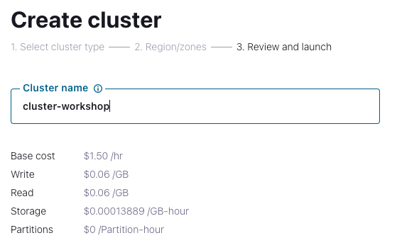

<div align="center" padding=25px>
    
</div>

# <div align="center">Microservices with C# and .NET</div>
## <div align="center">Lab Guide</div>
<br>

## **Agenda**

***

## **Architecture**

<div align="center">
    
</div>

*** 

## **Prerequisites**
<br>

1. Confluent Cloud Account
    - Sign-up for a Confluent Cloud account [here](https://www.confluent.io/confluent-cloud/tryfree/)
    - Once you have signed up and logged in, click on the menu icon at the upper right hand corner, click on "Billing & payment", then enter payment details under “Payment details & contacts”. A screenshot of the billing UI is included below.

    > **Note:** You will create resources during this workshop that will incur costs. When you sign up for a Confluent Cloud account, you will get free credits to use in Confluent Cloud. This will cover the cost of resources created during the workshop. More details on the specifics can be found [here](https://www.confluent.io/confluent-cloud/tryfree/).

2. Ports 443 and 9092 need to be open to the public internet for outbound traffic. To check, try accessing the following from your web browser:
    - portquiz.net:443
    - portquiz.net:9092

1. This workshop requires access to a command line interface.
    * **Mac users:** The standard Terminal application or iTerm2 are recommended.
    * **Windows users:** The built-in Command Prompt or Git BASH are recommended.  

1. Git access, see [here](https://git-scm.com/book/en/v2/Getting-Started-Installing-Git) for installation instructions. After installation, verify that the installation was successful with the following command:
    ```bash
    # Check the git version
    git --version
    ```
1. Clone Confluent's Commercial SE workshop repository to your machine to access useful files. 
    > **Note:** This repository contains **all** of the workshops and workshop series Confluent's Commercial SE team has created. Be sure to navigate to the correct sub-folder to use the right content.
    ```bash
    # clone the Commercial SE workshop repository
    git clone https://github.com/confluentinc/commercial-workshops.git
    ```
    Navigate to the correct sub-folder to access this labs content. This should act as your working directory for the remainder of the lab. 
    ```bash 
    # navigate to the correct sub-folder
    cd commercial-workshops/series-getting-started-with-cc/workshop-connectors/
    ```

***

## **Objective:**

## <a name="step-1"></a>**Step 1: Log in to Confluent Cloud**
1. Log in to [Confluent Cloud](https://confluent.cloud) and enter your email and password.

<div align="center" padding=25px>
    
</div>

2. If you are logging in for the first time, you will see a self-guided wizard that walks you through spinning up a cluster. Please minimize this as you will walk through those steps in this workshop. 

*** 

## <a name="step-2"></a>**Step 2: Create an Environment and Cluster**

An environment contains clusters and its deployed components such as Connectors, ksqlDB, and Schema Registry. You have the ability to create different environments based on your company's requirements. Confluent has seen companies use environments to separate Development/Testing, Pre-Production, and Production clusters.

1. Click **+ Add Environment**. Specify an **Environment Name** and Click **Create**. 

    >**Note:** There is a *default* environment ready in your account upon account creation. You can use this *default* environment for the purpose of this workshop if you do not wish to create an additional environment.

<div align="center" padding=25px>
    
</div>

2. Now that you have an environment, click **Create Cluster**. 

    > **Note:** Confluent Cloud clusters are available in 3 types: Basic, Standard, and Dedicated. Basic is intended for development use cases so you will use that for the workshop. Basic clusters only support single zone availability. Standard and Dedicated clusters are intended for production use and support Multi-zone deployments. If you are interested in learning more about the different types of clusters and their associated features and limits, refer to this [documentation](https://docs.confluent.io/current/cloud/clusters/cluster-types.html).

3. Choose the **Basic** Cluster Type. 

<div align="center" padding=25px>
    
</div>

4. Click **Begin Configuration**.
5. Choose your preferred Cloud Provider (AWS, GCP, or Azure), Region, and Availability Zone.
     * **Choose the cloud provider you have your object storage set up with** 
     * **Choose the same region where your object storage resource is deployed**

6. Specify a **Cluster Name** - any name will work here. 

<div align="center" padding=25px>
    
</div>

7. View the associated Configuration & Cost, Usage Limits, and Uptime SLA information before launching.

8. Click **Launch Cluster.**

<div align="center" padding=25px>
    
</div>

## <a name="step-3"></a>**Step 3: Create a ksqlDB Application**

1. On the navigation menu, select **ksqlDB** and click **Create Application Myself**. 
2. Select **Global Access** and then **Continue**.
3. Name you ksqlDB application and set the streaming units to **4**. Click **Launch Application!**

> **Note:** A Confluent Streaming Unit is the unit of pricing for Confluent Cloud ksqlDB. A CSU is an abstract unit that represents the size of your kSQL cluster and scales linearly. 

<div align="center" padding=25px>
    
</div>

## <a name="step-4"></a>**Step 4: Create a Topic and Cloud Dashboard Walkthrough**

1. On the left hand side navigation menu, you will see **Cluster**.

    This section shows Cluster Metrics, such as Throughput and Storage. This page also shows the number of Topics, Partitions, Connectors, and ksqlDB Applications.  Below is an example of the metrics dashboard once you have data flowing through Confluent Cloud. 

<div align="center" padding=25px>
    
</div>

2. Click on **Settings**. This is an important tab that should be noted. This is where you can find your cluster ID, bootstrap server, cloud details, cluster type, and capacity limits. 
3. Copy and save the bootstrap server - you will use it later in the workshop.
4. On that same navigation menu, select **Topics** and click **Create Topic**. 
5. Enter **dbserver1.inventory.customers** as the Topic name and **1** as the Number of partitions, then click on **Create with defaults**.
    <div align="center" padding=25px>
       
    </div>

    **dbserver1.inventory.customers** is the name of the table within the Postgres database you will be setting up in a later section.

    > **Note:** Topics have many configurable parameters that dictate how messages are handled. A complete list of those configurations for Confluent Cloud can be found [here](https://docs.confluent.io/cloud/current/using/broker-config.html).  If you are interested in viewing the default configurations, you can view them in the Topic Summary on the right side. 

6. After creation, the **Topics UI** allows you to monitor production and consumption throughput metrics and the configuration parameters for your topics. When you begin sending messages to Confluent Cloud, you will be able to view those messages and message schemas. 

7. Below is a look at your topic, dbserver1.inventory.customers, but you need to send data to this topic before you see any metrics. 
    <div align="center" padding=25px>
       
    </div>

## <a name="step-5"></a>**Step 5: Create an API Key Pair**

1. Select **API keys** on the navigation menu. 
2. If this is your first API key within your cluster, click **Create key**. If you have set up API keys in your cluster in the past and already have an existing API key, click **+ Add key**.
    <div align="center" padding=25px>
       
    </div>

3. Select **Global Access**, then click Next.
4. Save your API key and secret - you will need these during the workshop.
5. After creating and saving the API key, you will see this API key in the Confluent Cloud UI in the **API keys** tab. If you don’t see the API key populate right away, refresh the browser. 

## <a name="step-6"></a>**Step 6: Enable Schema Registry**

A topic contains messages, and each message is a key-value pair. The message key or the message value (or both) can be serialized as JSON, Avro, or Protobuf. A schema defines the structure of the data format. 

Confluent Cloud Schema Registry is used to manage schemas and it defines a scope in which schemas can evolve. It stores a versioned history of all schemas, provides multiple compatibility settings, and allows schemas to evolve according to these compatibility settings. It is also fully-managed.

You will be exploring Confluent Cloud Schema Registry in more detail towards the end of the workshop. First, you will need to enable Schema Registry within your environment.

1. Return to your environment by clicking on the Confluent icon at the top left corner and then clicking your environment tile.
  <div align="center">
      
  </div>

2. Click on **Schema Registry**. Select your cloud provider and region, and then click on **Enable Schema Registry**.
  <div align="center">
      
  </div>

## <a name="step-7"></a>**Step 7: Connect C# Producer and Consumer to Confluent Cloud**


## <a name="step-8"></a>**Step 8: Launch Fully-Managed Datagen Source Connector in Confluent Cloud**


